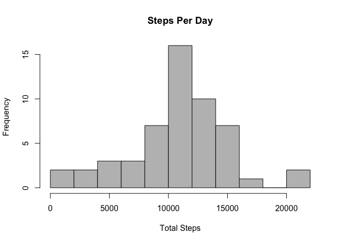
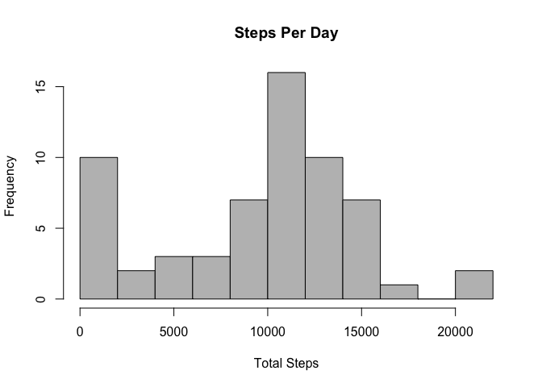
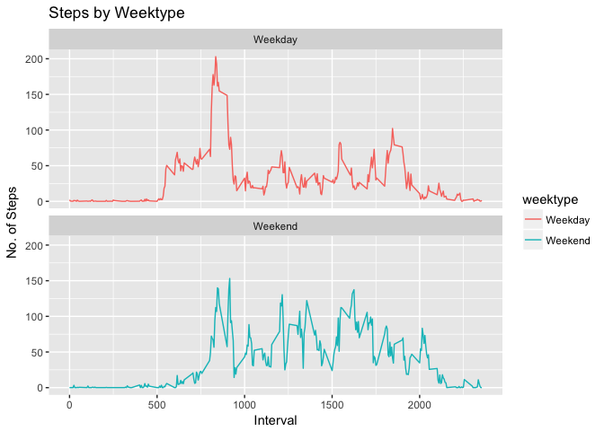

# Reproducible Research: Peer Assessment 1
## Index
- Loading and preprocessing the data
- What is mean total number of steps taken per day?
- What is the average daily activity pattern?
- Imputing missing values
- Are there differences in activity patterns between weekdays and weekends?
---
## Loading and preprocessing the data
#### Library packages

```r
library(dplyr)
```

```
## 
## Attaching package: 'dplyr'
```

```
## The following objects are masked from 'package:stats':
## 
##     filter, lag
```

```
## The following objects are masked from 'package:base':
## 
##     intersect, setdiff, setequal, union
```

```r
library(ggplot2)
```

#### Read the data

```r
activity_csv<-read.csv("activity.csv")
activity<-tbl_df(activity_csv)
head(activity)
```

```
## # A tibble: 6 × 3
##   steps       date interval
##   <int>     <fctr>    <int>
## 1    NA 2012-10-01        0
## 2    NA 2012-10-01        5
## 3    NA 2012-10-01       10
## 4    NA 2012-10-01       15
## 5    NA 2012-10-01       20
## 6    NA 2012-10-01       25
```

#### Basics of data

```r
summary(activity)
```

```
##      steps                date          interval     
##  Min.   :  0.00   2012-10-01:  288   Min.   :   0.0  
##  1st Qu.:  0.00   2012-10-02:  288   1st Qu.: 588.8  
##  Median :  0.00   2012-10-03:  288   Median :1177.5  
##  Mean   : 37.38   2012-10-04:  288   Mean   :1177.5  
##  3rd Qu.: 12.00   2012-10-05:  288   3rd Qu.:1766.2  
##  Max.   :806.00   2012-10-06:  288   Max.   :2355.0  
##  NA's   :2304     (Other)   :15840
```

## What is mean total number of steps taken per day?
#### Ignore the missing values and calculate the total number of steps of each day

```r
steps_perday=summarise(group_by(filter(activity,!is.na(steps)),date),sum(steps))
colnames(steps_perday)=c("date","steps_perday")
head(steps_perday)
```

```
## # A tibble: 6 × 2
##         date steps_perday
##       <fctr>        <int>
## 1 2012-10-02          126
## 2 2012-10-03        11352
## 3 2012-10-04        12116
## 4 2012-10-05        13294
## 5 2012-10-06        15420
## 6 2012-10-07        11015
```

#### Calculate the mean and median

```r
mean(steps_perday$steps_perday)
```

```
## [1] 10766.19
```

```r
median(steps_perday$steps_perday)
```

```
## [1] 10765
```

#### Draw the plot

```r
hist_steps_perday<-hist(steps_perday$steps_perday,breaks = 15,col = "grey",main = "Steps Per Day",xlab = "Total Steps")
```

<!-- -->


## What is the average daily activity pattern?
#### Calculate the average steps of each interval

```r
steps_interval<-summarise(group_by(filter(activity,!is.na(steps)),interval),mean(steps,na.rm = TRUE))
colnames(steps_interval)<-c("interval","mean")
head(steps_interval)
```

```
## # A tibble: 6 × 2
##   interval      mean
##      <int>     <dbl>
## 1        0 1.7169811
## 2        5 0.3396226
## 3       10 0.1320755
## 4       15 0.1509434
## 5       20 0.0754717
## 6       25 2.0943396
```

#### Draw the plot of average steps of each interval

```r
with(steps_interval,plot(interval,mean,type="l"),col="blue",main="Average Steps of Each Interval")
title(main = "Average Steps of Each Interval")
```

<!-- -->

#### Calculate the maximum

```r
steps_interval[which.max(steps_interval$mean),]
```

```
## # A tibble: 1 × 2
##   interval     mean
##      <int>    <dbl>
## 1      835 206.1698
```


## Imputing missing values
#### Calculate the number of NAs

```r
sum(is.na(activity))
```

```
## [1] 2304
```

#### Create a strategy to fill in the NAs: using mean of 5 minutes interval to replace all NAs

```r
activity2<-activity
na<-is.na(activity$steps)
activity2[na,1]<-steps_interval[2,2]
head(activity2)
```

```
## # A tibble: 6 × 3
##       steps       date interval
##       <dbl>     <fctr>    <int>
## 1 0.3396226 2012-10-01        0
## 2 0.3396226 2012-10-01        5
## 3 0.3396226 2012-10-01       10
## 4 0.3396226 2012-10-01       15
## 5 0.3396226 2012-10-01       20
## 6 0.3396226 2012-10-01       25
```

#### Check if there is no NAs in the data

```r
sum(is.na(activity2))
```

```
## [1] 0
```
#### Calculate the total number of steps per day [new]

```r
steps_perday_new=summarise(group_by(activity2,date),sum(steps))
colnames(steps_perday_new)<-c("date","steps_perday")
head(steps_perday_new)
```

```
## # A tibble: 6 × 2
##         date steps_perday
##       <fctr>        <dbl>
## 1 2012-10-01     97.81132
## 2 2012-10-02    126.00000
## 3 2012-10-03  11352.00000
## 4 2012-10-04  12116.00000
## 5 2012-10-05  13294.00000
## 6 2012-10-06  15420.00000
```
#### Draw a new hist of steps per day

```r
hist_steps_perday_new<-hist(steps_perday_new$steps_perday,breaks = 15,col = "grey",main = "Steps Per Day",xlab = "Total Steps")
```

<!-- -->
#### Calculate the mean and the median

```r
mean(steps_perday_new$steps_perday)
```

```
## [1] 9367.057
```

```r
median(steps_perday_new$steps_perday)
```

```
## [1] 10395
```


## Are there differences in activity patterns between weekdays and weekends?
#### Change the date(factor) to Date

```r
activity_date<-as.Date(activity$date)
head(activity_date)
```

```
## [1] "2012-10-01" "2012-10-01" "2012-10-01" "2012-10-01" "2012-10-01"
## [6] "2012-10-01"
```
#### Create a weekday variable

```r
activity_week<-weekdays(activity_date)
head(activity_week)
```

```
## [1] "Monday" "Monday" "Monday" "Monday" "Monday" "Monday"
```
#### Add the new variable to the original data

```r
activity3<-mutate(activity2,activity_week)
activity3<-mutate(activity3,weektype= ifelse(activity3$activity_week=="Saturday" |activity3$activity_week=="Sunday", "Weekend", "Weekday"))
head(activity3)
```

```
## # A tibble: 6 × 5
##       steps       date interval activity_week weektype
##       <dbl>     <fctr>    <int>         <chr>    <chr>
## 1 0.3396226 2012-10-01        0        Monday  Weekday
## 2 0.3396226 2012-10-01        5        Monday  Weekday
## 3 0.3396226 2012-10-01       10        Monday  Weekday
## 4 0.3396226 2012-10-01       15        Monday  Weekday
## 5 0.3396226 2012-10-01       20        Monday  Weekday
## 6 0.3396226 2012-10-01       25        Monday  Weekday
```
#### Calculate the steps of each interval of both weekends and weekdays

```r
steps_interval_weektypes<-summarise(group_by(activity3,interval,weektype),mean(steps))
colnames(steps_interval_weektypes)<-c("interval","weektype","steps")
head(steps_interval_weektypes)
```

```
## Source: local data frame [6 x 3]
## Groups: interval [3]
## 
##   interval weektype      steps
##      <int>    <chr>      <dbl>
## 1        0  Weekday 2.06750524
## 2        0  Weekend 0.04245283
## 3        5  Weekday 0.44528302
## 4        5  Weekend 0.04245283
## 5       10  Weekday 0.20083857
## 6       10  Weekend 0.04245283
```
#### Draw the plot

```r
plot<- ggplot(steps_interval_weektypes, aes(x =interval , y=steps, color=weektype)) +
  geom_line() +
  labs(title = "Steps by Weektype", x = "Interval", y = "No. of Steps") +
  facet_wrap(~weektype, ncol = 1, nrow=2)
print(plot)
```

<!-- -->

